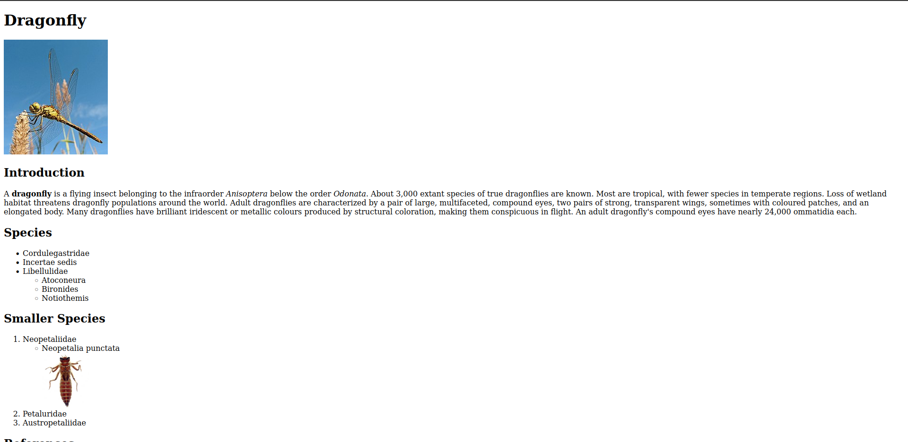

# Daniel Portasany Codina
## Estudiante de DAM1
### Contacto
    Teléfono:   12345679         
    E-mail:     a23danielpc@iessanclemente.net

### Estudios
+ Título de ESO 2015 - 2020 (IES Gonzalo Torrente Ballester, Pontevedra) 
+ Título de SMR 2021 - 2023 (IES Chan do Monte, Marín) 
+ Título de DAM 2023 - HOY (IES San Clemente, Santiago de Compostela)

### Experiencia Laboral
+ Departamento de Mantenimiento de la Universidad de Rethymno (Creta, 2023), como parte de practicas laborales en el extranjero
+ Trabajos de mantenimiento a equipos infórmaticos de manera independiente

### Conocimientos
+ Uso básico de lenguajes de programación
    + Java
    + Python
+ Uso básico de lenguajes y herramientas de desarrollo web
    + HTML
    + CSS
    + Wordpress
    + Moodle
+ Conocimientos practicos de redes locales y hardware

### Idiomas
+ Español (Lengua Materna)
+ Gallego (Segunda Lengua)
+ Inglés (Medio)

### Mis Códigos
[Muestra](./muestra.md)
#### Repositorio GitHub
